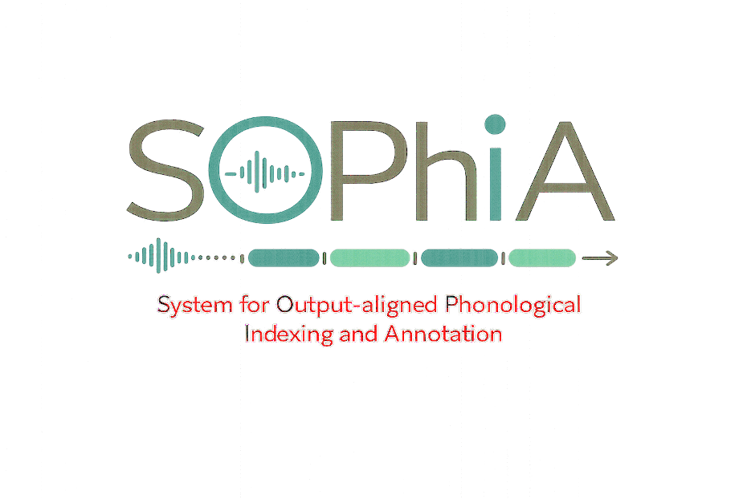
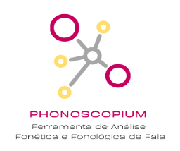
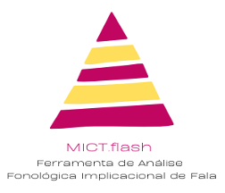

<div align="center">



**System for Output-aligned Phonological Indexing and Annotation**

*Plataforma de avaliação fonológica clínica de fala infantil em Português Europeu*
*A clinical phonological assessment platform for child speech in European Portuguese*

[🇵🇹 Português](#-português) · [🇬🇧 English](#-english)

</div>

---

## 🇵🇹 Português

### O que a SOPhIA faz

A SOPhIA constrói, para cada criança, um perfil fonológico detalhado — métricas, inventário, processos, padrões. Reunidos vários perfis, o terreno abre-se à análise distribucional, para além da comparação de médias. Cada utilizador selecciona e exporta os indicadores que servem o seu fim, clínico ou de investigação.

### O que a SOPhIA não faz

- Não diagnostica.
- Não compara automaticamente com normas etárias para emitir juízo clínico.
- Não recomenda intervenção.

A interpretação clínica é da terapeuta.

### Flexibilidade de entrada

A SOPhIA aceita o que cada utilizador tiver, e adapta-se ao que cada utilizador quiser fazer:

- **Áudio** gravado durante a sessão clínica, transcrito automaticamente pelo modelo *wav2vec2* PE-tuned, com revisão da terapeuta.
- **IPA manual**, escrito directamente, sem áudio.
- **Excel ou CSV** com pares alvo–produção pré-existentes.
- **Par alvo–produção isolado**, para análise pontual.

O léxico-alvo pode vir de protocolos formais — TFF-ALPE, TAV — ou ser definido livremente pela terapeuta. No horizonte, suporte a discurso espontâneo.

Qualquer combinação de entrada é processada pelo mesmo *pipeline* e produz o mesmo perfil fonológico.

### Pipeline

```
[áudio · IPA manual · Excel/CSV pré-transcrito]
        ↓
transcrição automática (modelo wav2vec2 PE-tuned)
        ↓
validação e normalização IPA
        ↓
silabificação fonotáctica do PE
        ↓
alinhamento alvo–produção (Needleman-Wunsch silábico)
        ↓
detecção de processos · padrões vectoriais · métricas · inventário
        ↓
PERFIL FONOLÓGICO
        ↓
análises (Phonoscopium · MICT.flash · Análise Vectorial por Traços)
        ↓
relatório clínico
```

### O perfil fonológico

Para cada criança, a SOPhIA constrói:

- **Métricas** — PCC, PCC ponderado, PVC, PSC.
- **Inventário** — fonético e fonológico, com critério Bernhardt (76%); estados *adquirido*, *emergente*, *ausente*.
- **Composição da amostra** — frequência de cada fonema-alvo, com impacto no cálculo das métricas.
- **Processos detectados** — mais de trinta tipos distintos, segmentais e de palavra. Inclui pacotes recentes: simplificação de velar labializada (kw, gw); elisão de vogal átona em hiato com ataque ressilabificado; harmonias consonânticas e vocálicas; metáteses inter- e intra-silábicas; reduplicação; migração; epêntese.
- **Padrões vectoriais** — análise sobre 16 dimensões fonológicas, com dois denominadores (substituições D1, oportunidades D2) e dois níveis de reporte (Sistemático, Observado).
- **Perfil por fonema** — para cada fonema problemático: ocorrências, processos, contextos silábicos, distorções fonéticas detectadas.
- **Texto interpretativo** — gerado automaticamente, articulando métricas, inventário e perfil.

### Análises

Sobre o perfil fonológico estão disponíveis três análises. Cada uma selecciona variáveis distintas do perfil e organiza-as segundo o seu enquadramento teórico. O perfil é único; as análises são múltiplas.

#### Phonoscopium



**Phonoscopium — Ferramenta de Análise Fonética e Fonológica de Fala**
Alves, D. C., Almeida, D., Ferreira, D., Jorge, M., & Silva, M. (2023). Escola Superior de Saúde do Instituto Politécnico de Setúbal.

Análise contrastiva implicacional, taxonomia formalizada de processos, MICT-PB (Mota, 1996), PAC-PE (Amorim, 2014; Lazzarotto-Volcão, 2019). Inventários fonético e fonológico em matriz Modo×Ponto×Sonoridade, substituições por fonema-alvo, contagens por traço distintivo, análise silábica cruzada com contextos de acento e posição.

*Adaptação digital ao ambiente SOPhIA por Joana Miguel, com autorização da equipa autora.*

#### MICT.flash



**MICT.flash — Ferramenta de Análise Fonológica Implicacional de Fala**
Alves, D. C., & Lamela, C. (2023). Escola Superior de Saúde do Instituto Politécnico de Setúbal.

Árvore individualizada de hipóteses sobre o sistema nuclear da criança. Calcula H1 (alvo primário) e H2 (alvo secundário) a partir do inventário individual e da estrutura de traços marcados. A hierarquia MICT-PB (Mota, 1996) entra como referência orientadora, não como matriz fixa de comparação.

*Integração ao ambiente SOPhIA por Joana Miguel, com autorização da equipa autora.*

#### Análise Vectorial por Traços (CAIDI)

*Proposta de análise vectorial dimensional — abordagem em desenvolvimento.*

Cada fonema do PE é representado num espaço de 16 dimensões: quatro contínuas (continuidade, ponto de articulação, altura vocálica, anterioridade) e doze binárias (sonoridade, vozeamento, nasalidade, lateralidade, vibração, silabicidade, labialidade, bilabialidade, coronalidade, dorsalidade, radicalidade, arredondamento), com pesos próprios calibrados para a clínica. As dimensões contínuas têm correlatos articulatório-acústicos directos.

As substituições alvo→produção são tomadas como vectores neste espaço. Padrões emergem por agregação direccional; redundâncias vectoriais são suprimidas — a oclusão de uma fricativa não é contada também como obstrução. Dois denominadores (D1: substituições; D2: oportunidades) e dois níveis de reporte (Sistemático, Observado).

Habilita análise distribucional sobre múltiplos perfis (geometria entre crianças) e abre caminho a integração com medições acústicas dos áudios das sessões.

### Modos de utilização

1. **Protocolo de teste** — Recolha (com a criança) → Revisão (sem a criança) → Resultados.
2. **Análise de ficheiro** — *upload* de Excel ou CSV.
3. **Análise rápida** — par alvo–produção isolado.

### Funcionalidades

- Transcrição automática áudio → IPA, em segundo plano, sem bloquear a sessão clínica. Modelo wav2vec2 com fine-tuning para Português Europeu.
- Léxico clínico integrado: TFF-ALPE, TAV, lexico livre, com IPA-alvo definido.
- Validação e normalização do input IPA, com detecção de distorção fonética via diacríticos.
- Silabificação fonotáctica do PE, com modo permissivo para produções desviantes.
- Alinhamento Needleman-Wunsch — motor silábico (default) ou segmental.
- Detecção de processos a dois níveis: segmental (constituinte) e palavra (inter-silábico).
- Comparação com normas PE da literatura (Mendes et al. 2009/2013, Amorim 2014, Costa 2010, Domingues 2013).
- Persistência em Google Drive, organizada por *Ano / Criança / Sessão*.
- Relatório clínico em Word, PDF visual com gráficos, e Excel detalhado.
- Workflow clínico em três fases, desenhado para o tempo da consulta.

### No horizonte

- Selector de variáveis a exportar — CSV/JSON estruturado para análise distribucional.
- MICT-PE com normativos do Corpus Ramalho (em preparação por Dina Caetano Alves).
- Integração com medições acústicas: alinhamento temporal dos áudios e mapeamento para o espaço fonológico.
- Fine-tuning do modelo wav2vec2 com dados PE acumulados nas sessões clínicas.
- Suporte a discurso espontâneo (ASR mais sofisticado + interpretação contextual).

### Arquitectura

```
fonologia_pe/                    motor linguístico
├── tracos.py                    espaço fonológico, vectores, distâncias
├── parser_silabico.py           silabificação fonotáctica do PE
├── alinhamento.py               Needleman-Wunsch silábico e segmental
├── processos.py                 detecção de processos (segmentais e de palavra)
├── analise.py                   dispatcher, métricas, perfil
├── padroes.py                   análise vectorial 16-dim, D1/D2, supressão
├── mict.py                      MICT.flash individualizado
├── normas.py                    comparação com literatura PE
├── validacao_ipa.py             validação, distorções, decisões da terapeuta
├── normalizacao_pe.py           correcções pós-modelo HF
├── textos_padroes.py            geração de texto clínico
└── protocolos.py                léxico TFF-ALPE, TAV, espontâneo

raiz/                            interface, transcrição, persistência
├── app.py                       aplicação Streamlit
├── audio_transcricao.py         workflow clínico em 3 fases
├── transcricao_api.py           ponte para HuggingFace Space (PE wav2vec2)
├── drive_upload.py              persistência Google Drive
├── relatorio.py                 geração de relatório Word
├── pdf_export.py                exportação PDF com gráficos
└── templates.py                 templates Excel para importação
```

### Contexto institucional

A SOPhIA é desenvolvida por **Joana Miguel** no **NID CAIDI** — Núcleo de Investigação e Desenvolvimento do *Centro de Apoio e Intervenção no Desenvolvimento Infantil*. A autora tem afiliação adicional ao CLUNL (Centro de Linguística da Universidade Nova de Lisboa) e à ESE João de Deus.

### Citação

> Miguel, J. (2026). *SOPhIA — System for Output-aligned Phonological Indexing and Annotation*. Desenvolvida no NID CAIDI. [Código sob acesso por solicitação.]

### Acesso ao código

A SOPhIA está em desenvolvimento activo. O código fonte é, de momento, fechado. Acessos individuais para colaboração, investigação ou avaliação podem ser solicitados a:

- **Joana Miguel** — [joana.miguel@caidi.pt](mailto:joana.miguel@caidi.pt)
- **CAIDI** (geral) — [geral@caidi.pt](mailto:geral@caidi.pt)

Indicar contexto (clínico, investigação, docente), instituição, e propósito da utilização.

### Licença

© 2025–2026 Joana Miguel — CAIDI. Todos os direitos reservados.

---

## 🇬🇧 English

### What SOPhIA does

For each child, SOPhIA builds a detailed phonological profile — metrics, inventory, processes, patterns. As multiple profiles accumulate, the ground opens up to distributional analysis, beyond mere comparison of means. Each user selects and exports the indicators that serve their purpose, clinical or research.

### What SOPhIA does not do

- It does not diagnose.
- It does not automatically compare against age norms to issue clinical judgement.
- It does not recommend intervention.

Clinical interpretation is the therapist's.

### Input flexibility

SOPhIA accepts what each user has, and adapts to what each user wants to do:

- **Audio** recorded during the clinical session, automatically transcribed by the PE-tuned *wav2vec2* model, with therapist review.
- **Manual IPA**, written directly, without audio.
- **Excel or CSV** with pre-existing target–production pairs.
- **Isolated target–production pair**, for one-off analysis.

The target lexicon can come from formal protocols — TFF-ALPE, TAV — or be defined freely by the therapist. Spontaneous speech support is on the roadmap.

Any combination of input is processed by the same *pipeline* and yields the same phonological profile.

### Pipeline

```
[audio · manual IPA · pre-transcribed Excel/CSV]
        ↓
automatic transcription (PE-tuned wav2vec2)
        ↓
IPA validation and normalisation
        ↓
European Portuguese phonotactic syllabification
        ↓
target–production alignment (syllabic Needleman-Wunsch)
        ↓
process detection · vectorial patterns · metrics · inventory
        ↓
PHONOLOGICAL PROFILE
        ↓
analyses (Phonoscopium · MICT.flash · Featural Vector Analysis)
        ↓
clinical report
```

### The phonological profile

For each child, SOPhIA constructs:

- **Metrics** — PCC, weighted PCC, PVC, PSC.
- **Inventory** — phonetic and phonological, with the Bernhardt 76% criterion; states *acquired*, *emergent*, *absent*.
- **Sample composition** — frequency of each target phoneme, factored into metric calculation.
- **Detected processes** — over thirty distinct types, segmental and word-level. Includes recent additions: labialised velar simplification (kw, gw); unstressed vowel elision in hiatus with onset resyllabification; consonantal and vocalic harmonies; inter- and intra-syllabic metatheses; reduplication; migration; epenthesis.
- **Vectorial patterns** — analysis across 16 phonological dimensions, with two denominators (D1: substitutions; D2: opportunities) and two reporting levels (Systematic, Observed).
- **Per-phoneme profile** — for each problematic phoneme: occurrences, processes, syllabic contexts, detected phonetic distortions.
- **Interpretive text** — automatically generated, articulating metrics, inventory and profile.

### Analyses

Three analyses are available over the phonological profile. Each selects distinct variables from the profile and organises them according to its theoretical framework. The profile is one; the analyses are many.

#### Phonoscopium


**Phonoscopium — Phonetic and Phonological Speech Analysis Tool**
Alves, D. C., Almeida, D., Ferreira, D., Jorge, M., & Silva, M. (2023). School of Health, Polytechnic Institute of Setúbal.

Implicational contrastive analysis, formalised process taxonomy, MICT-PB (Mota, 1996), PAC-PE (Amorim, 2014; Lazzarotto-Volcão, 2019). Phonetic and phonological inventories in Manner×Place×Voicing matrix, substitutions by target phoneme, distinctive feature counts, syllabic analysis crossed with stress and position contexts.

*Digital adaptation to the SOPhIA environment by Joana Miguel, with authorisation from the authoring team.*

#### MICT.flash


**MICT.flash — Implicational Phonological Speech Analysis Tool**
Alves, D. C., & Lamela, C. (2023). School of Health, Polytechnic Institute of Setúbal.

Individualised hypothesis tree about the child's nuclear system. Computes H1 (primary target) and H2 (secondary target) from the individual inventory and the structure of marked features. The MICT-PB hierarchy (Mota, 1996) enters as orienting reference, not as fixed comparison matrix.

*Integration into the SOPhIA environment by Joana Miguel, with authorisation from the authoring team.*

#### Featural Vector Analysis (CAIDI)

*A proposed vectorial dimensional analysis — approach under development.*

Each phoneme of European Portuguese is represented in a 16-dimensional space: four continuous dimensions (continuancy, place of articulation, vowel height, anteriority) and twelve binary ones (sonority, voicing, nasality, laterality, vibration, syllabicity, labiality, bilabiality, coronality, dorsality, radicality, rounding), with proper weights calibrated for clinical use. The continuous dimensions have direct articulatory-acoustic correlates.

Target→production substitutions are taken as vectors in this space. Patterns emerge through directional aggregation; vectorial redundancies are suppressed — fricative stopping is not also counted as obstruction. Two denominators (D1: substitutions; D2: opportunities) and two reporting levels (Systematic, Observed).

Enables distributional analysis across multiple profiles (geometry between children) and opens the way to integration with acoustic measurements from session recordings.

### Modes of use

1. **Test protocol** — Collection (with the child) → Review (without the child) → Results.
2. **File analysis** — Excel or CSV upload.
3. **Quick analysis** — isolated target–production pair.

### Features

- Automatic audio → IPA transcription, running in the background without blocking the clinical session. wav2vec2 model fine-tuned for European Portuguese.
- Integrated clinical lexicon: TFF-ALPE, TAV, free lexicon, with defined target IPA.
- IPA input validation and normalisation, with phonetic distortion detection via diacritics.
- European Portuguese phonotactic syllabification, with permissive mode for deviant productions.
- Needleman-Wunsch alignment — syllabic engine (default) or segmental.
- Two-level process detection: segmental (constituent) and word-level (inter-syllabic).
- Comparison with European Portuguese norms from the literature (Mendes et al. 2009/2013, Amorim 2014, Costa 2010, Domingues 2013).
- Google Drive persistence, organised by *Year / Child / Session*.
- Clinical report in Word, visual PDF with charts, and detailed Excel.
- Three-phase clinical workflow, designed for consultation time.

### Roadmap

- Selectable export variables — structured CSV/JSON for distributional analysis.
- MICT-PE with normative data from the Ramalho Corpus (in preparation by Dina Caetano Alves).
- Integration with acoustic measurements: temporal alignment of audio and mapping to the phonological space.
- wav2vec2 model fine-tuning with European Portuguese data accumulated through clinical sessions.
- Spontaneous speech support (more sophisticated ASR + contextual interpretation).

### Architecture

```
fonologia_pe/                    linguistic engine
├── tracos.py                    phonological space, vectors, distances
├── parser_silabico.py           European Portuguese phonotactic syllabification
├── alinhamento.py               syllabic and segmental Needleman-Wunsch
├── processos.py                 process detection (segmental and word-level)
├── analise.py                   dispatcher, metrics, profile
├── padroes.py                   16-dim vectorial analysis, D1/D2, suppression
├── mict.py                      individualised MICT.flash
├── normas.py                    comparison with European Portuguese literature
├── validacao_ipa.py             validation, distortions, therapist decisions
├── normalizacao_pe.py           post-HF model corrections
├── textos_padroes.py            clinical text generation
└── protocolos.py                TFF-ALPE, TAV, spontaneous lexicon

root/                            interface, transcription, persistence
├── app.py                       Streamlit application
├── audio_transcricao.py         three-phase clinical workflow
├── transcricao_api.py           bridge to HuggingFace Space (PE wav2vec2)
├── drive_upload.py              Google Drive persistence
├── relatorio.py                 Word report generation
├── pdf_export.py                PDF export with charts
└── templates.py                 Excel templates for import
```

### Institutional context

SOPhIA is developed by **Joana Miguel** at **NID CAIDI** — *Núcleo de Investigação e Desenvolvimento* of the *Centro de Apoio e Intervenção no Desenvolvimento Infantil* (Centre for Child Developmental Support and Intervention). The author holds additional affiliation with CLUNL (Centre of Linguistics, NOVA University of Lisbon) and ESE João de Deus.

### Citation

> Miguel, J. (2026). *SOPhIA — System for Output-aligned Phonological Indexing and Annotation*. Developed at NID CAIDI. [Source code under access by request.]

### Code access

SOPhIA is under active development. The source code is, at present, closed. Individual access for collaboration, research or evaluation may be requested from:

- **Joana Miguel** — [joana.miguel@caidi.pt](mailto:joana.miguel@caidi.pt)
- **CAIDI** (general) — [geral@caidi.pt](mailto:geral@caidi.pt)

Please specify context (clinical, research, teaching), institution, and intended purpose.

### License

© 2025–2026 Joana Miguel — CAIDI. All rights reserved.
